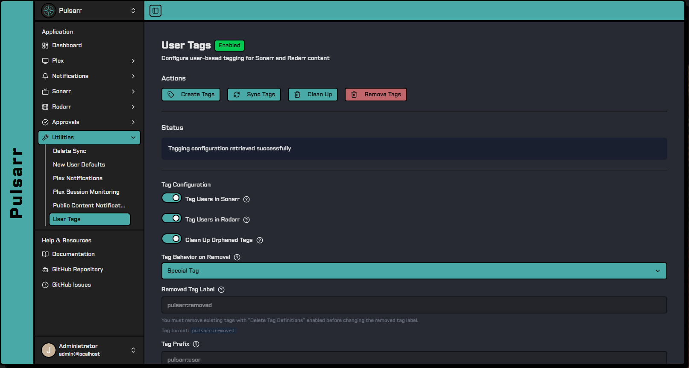

# User Tagging

Pulsarr's User Tagging feature organizes your media by automatically adding user tags to content in Sonarr and Radarr, making it easy to track which users requested which content.

## Key Features

- **Automatic User Tracking**: Tags movies and shows with the usernames of people who added them to their watchlists
- **Multi-Instance Support**: Works across all your Sonarr and Radarr instances simultaneously
- **Customizable Prefix**: Configure your own prefix for user tags (default: "pulsarr:user")
- **Enhanced Tag Management**: Flexible tag removal options when content leaves watchlists
- **Tag-Based Deletion**: Option to use tags for content deletion instead of watchlist status
- **Batch Processing**: Efficiently processes large libraries with minimal performance impact

## Usage Benefits

- **Content Organization**: Easily identify who requested specific content
- **User-Based Filtering**: Create custom filters in Sonarr/Radarr based on user tags
- **Accountability**: Track which users are driving your media library growth
- **Lifecycle Management**: Use tags to manage content from request to removal
- **Management**: Quickly find all content requested by specific users
- **Integration**: Works seamlessly with Sonarr and Radarr's existing tag system

## Configuration

1. Navigate to the **Utilities** section in the Pulsarr web interface
2. Find the User Tagging section
3. Configure options including:
   - Enable/disable tagging for Sonarr and Radarr
   - Set a custom tag prefix
   - Choose whether to preserve historical tags
   - Enable/disable cleanup of orphaned tags
4. Save your changes to apply the settings
5. Click "Sync Tags Now" to immediately apply tags to all content

## Enhanced Tag Management

When content is removed from a user's watchlist, you have multiple options for handling the associated tags:

- **Keep**: Preserve tags for historical tracking even after content is removed from watchlists
- **Remove**: Delete tags when content is removed from watchlists
- **Prefix**: Add a customizable prefix (e.g., "removed:") to existing tags when content is removed from watchlists

These tag management options work seamlessly with Delete Sync's tag-based deletion mode, allowing you to:
- Identify content for deletion based on tag status rather than watchlist presence
- Maintain historical records of who requested content
- Create custom workflows based on tag lifecycle

## Advanced Settings

- **Tag Prefix**: Customize the prefix used for all user tags (default: "pulsarr:user")
- **Tag Removal Options**: Configure how tags are handled when content is removed from watchlists
- **Customizable Removal Prefix**: Define your own prefix for removed content tags
- **Tag-Based Deletion**: Enable tags to identify content for deletion instead of watchlist status
- **Preserve Historical Tags**: When enabled, keeps tags even after content is removed from a user's watchlist
- **Clean Up Orphaned Tags**: Automatically removes tags for deleted users
- **Manual Tag Removal**: Option to remove all user tags if needed

## Integration with Delete Sync

User Tagging works seamlessly with Delete Sync's tag-based deletion mode:
- Configure tags to be added, modified, or removed based on watchlist changes
- Use tag status to determine when content should be deleted
- Protect content with specific tags from deletion
- Create complex deletion workflows based on tag lifecycle

